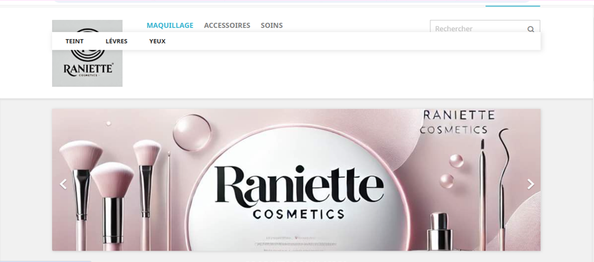

  

<h1 align="center">💄 Projet E-commerce – Boutique de Maquillage</h1>

  <b>Projet universitaire • E-commerce • Design moderne • UX</b>

  
  
  
  

---

## 🟥 Présentation du projet
Ce projet consiste en la conception d’une boutique en ligne spécialisée
dans la vente de produits de maquillage.  
Il a été réalisé dans le cadre d’un projet universitaire.

Le site permet de présenter différents produits cosmétiques
à travers une interface moderne, claire et intuitive.

---

## 🟥 Objectifs du projet
-  Concevoir un site e-commerce attractif  
-  Mettre en valeur les produits cosmétiques  
-  Simuler un parcours d’achat en ligne  
-  Améliorer l’expérience utilisateur  
-  Appliquer les notions de développement web  

---

## 🟥 Utilisateurs cibles
-  Clients intéressés par les produits de beauté  
-  Étudiants  
-  Visiteurs du site  
-  Acheteurs en ligne  

---

## 🟥 Fonctionnalités principales
-  Page d’accueil avec présentation de la boutique  
-  Navigation par catégories  
-  Affichage des produits  
-  Interface responsive  
-  Galerie d’images  
-  Design moderne  

---

## 🟥 Conception et design
-  Design féminin et élégant  
-  Utilisation d’images professionnelles  
-  Organisation claire des sections  
-  Navigation fluide  

---

## 🟥 Technologies utilisées
-  HTML  
-  CSS  
-  JavaScript  

---

## 🟥 Captures d’écran (aperçu)

  
  
  

---

  <i>📁 Dépôt destiné à la présentation du projet dans un cadre académique (portfolio).</i>

